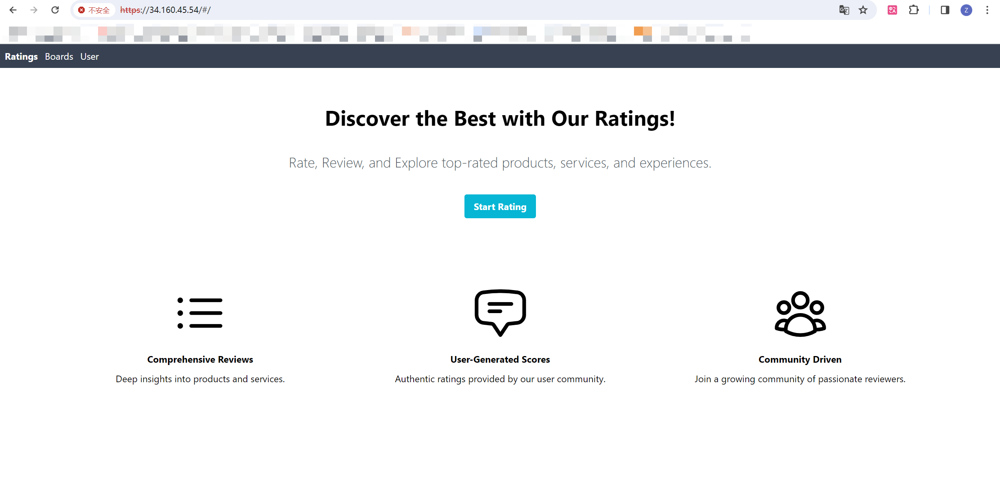
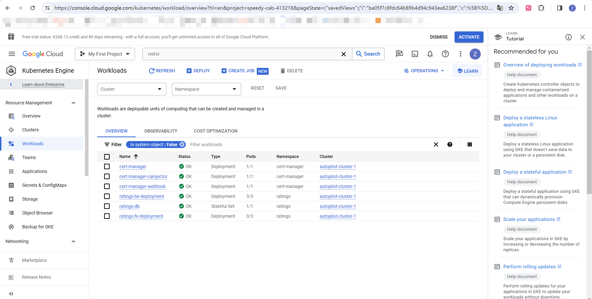

# Ratings

This repository holds all our project files.

For frontend code, also check: https://github.com/wzy1935/ratings_fe

For backend code, also check: https://github.com/wzy1935/ratings_be


## Persistent layer

Our application uses Postgres as the database. Check `./db/` to see the initial SQL file and the Dockerfile. Our container is hosted at DockerHub (`wzy1935/ratings_db`).

We use the Statefulset to host the container. Using ingress, users outside the cluster can not access to the database. All of our configuration and secret are stored at `ratings-configmap-all` and `ratings-secret-all`, separately.


## API & Frontend

Our application supports rich functions, e.g., get ratings (GET) or create ratings (POST). The frontend and the backend container are separate, and their Dockerfile can be checked at `./ratings_fe/` and `./ratings_be/`. Their container are also hosted at DockerHub (`wzy1935/ratings_fe` and `kokonot88/ratings_be`). We use Ingress to map the API path and allow users outside to access our application.


## TLS


## Helm Chart

We created a Helm Chart to package the whole application. To deploy our application in K8s, run:

```
helm install ratings-helm ./helm/ratings-helm
```

Beware, before running this command, you need to create a namespace **BEFORE install the chart** with the same  value in `application.namespace` field at `values.yaml`; If deployment is at local environment (using Ingress-NGINX), `application.local` field should also set as true.

To add our chart to your local helm repo, run:

```
helm repo add <YOUR_REPO> https://wzy1935.github.io/ratings_helm/
helm repo update
```

To install the added one, run: (or the one provided above)

```
helm install ratings-helm <YOUR_REPO>/ratings-helm
```

To uninstall, run:

```
helm uninstall ratings-helm
```

To upgrade, run (if you use the source file in this folder):

```
helm upgrade ratings-helm ./helm/ratings-helm
```


## Network policies

For network policy, we define 3 of them to limit port ingress. The yaml file are in `./k8s/`. In short, we limit:

- Frontend ingress with port 80;
- Backend ingress with port 8080;
- Database ingress with port 5432.


## RBAC

We created three roles to manage permissions:

- (ClusterRole) ratings-admin: have full access to all resources.
- (Role) ratings-developer: can view, update, delete the project services, pods, status, etc.
- (Role) ratings-viewer: can only view the project services, pods, status, etc.

Run `kubectl describe clusterroles ratings-admin` and `kubectl describe roles -n ratings` for details.


## Google Cloud Platform

Our application are hosted at GCP. Here're some example screen shots:





Please check our presentation for details.
